# SEYYAH- Mobile Crawler Robot Platform for Robotic Research

SEYYAH is a **ROS** based **mobile crawler robot** designed by **Ankara University Artificial Intelligence and Image Processing Labs (TR: YAZGİT labs)** to use in academical projects. It is a robot with a *360° laser range scanner*, a *camera*, *two wifi card*(to connect multiple networks at a time), *nvidia jetson tx2* power, *internal battery*. It also has an oled display that shows the current status and a led display that shows voltage status to make its developers job easier.


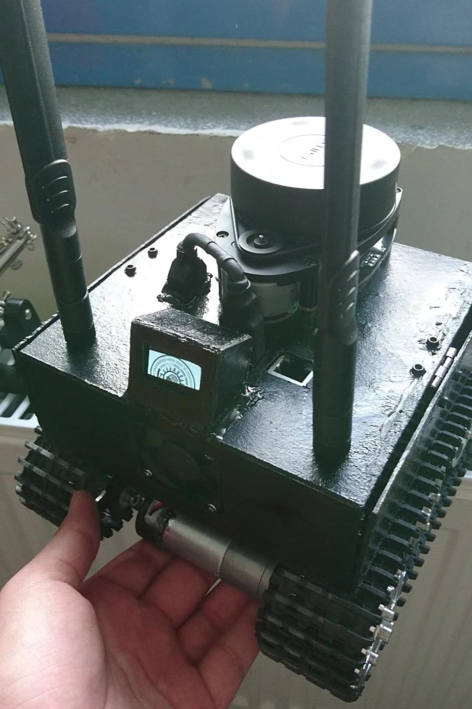

## Launch files

To drive the robot with a gamepad and get ready all parts of robot

```
roslaunch seyyah joy.launch
``` 

To drive the robot with keyboard and get ready all parts of robot

```
roslaunch seyyah keyboard_teleop.launch
``` 

To get ready all parts of robot

```
roslaunch seyyah bringup.launch
``` 

## Hardware parts

| Hardware Name                                     |Mission                                                    |Photo                                                                    |
|---------------------------------------------------|-----------------------------------------------------------|-------------------------------------------------------------------------|
|**Nvidia TX2 with Orbitty Carrier Board**          |`Main Computer`                                            |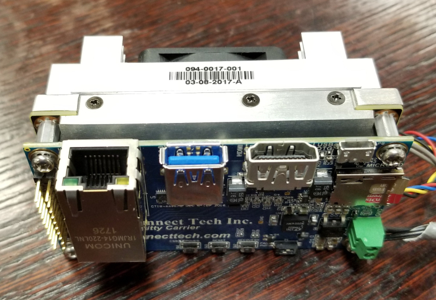  |
|**Slamtec RPLIDAR A1**                             |`360° Laser Range Scanner`                                 |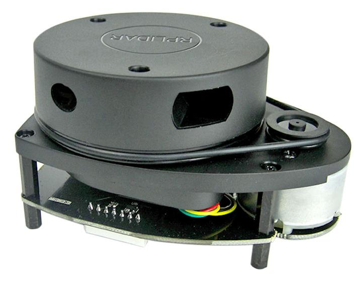                          |
|**Arduino MKR1000**                                |`Base Controller`                                          |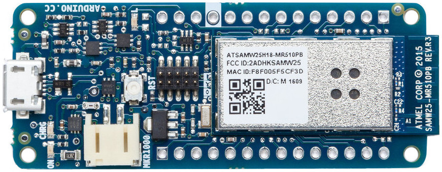                        |
|**Adafruit BNO055 Absolute Orientation Sensor**    |`IMU`                                                      |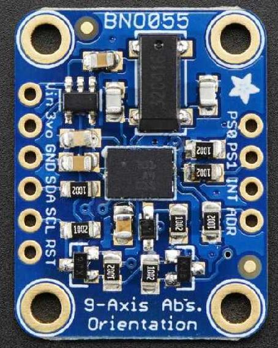                        |
|**Sparkfun TB6612FNG**                             |`Motor Driver`                                             |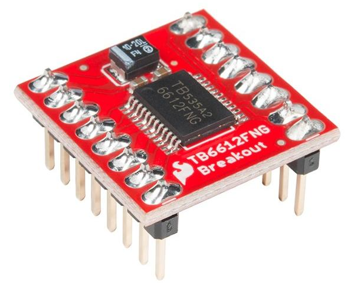                           |
|**SZDoit Mini T100**                               |`Tracked Subframe`                                         |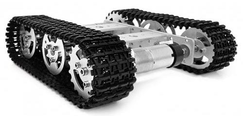                           |
|**USB Webcam**                                     |`Camera`                                                   |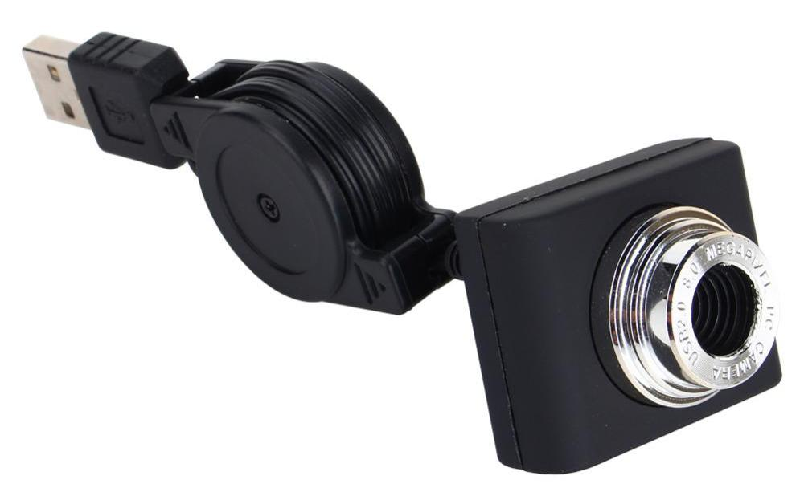                                  |
|**LM2596 5V 3A Step-Down Voltage Regulator**       |`Voltage Regulator For 5V Devices`                         |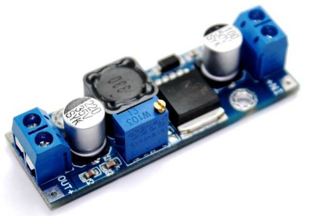                                          |
|**3400 mAh 3S Lipo Battery**                       |`Power Supply`                                             |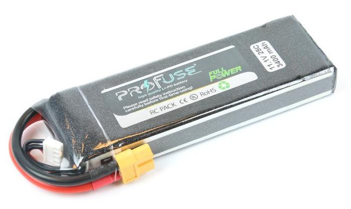                              |
|**Voltmeter**                                      |`Battery Charge Status Display`                            |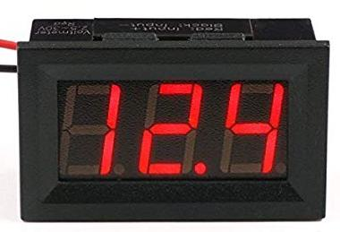                                    |
|**I2C Oled Display**                               |`Robot Status Display(IP, Temp, Cpu, Mem...)`              |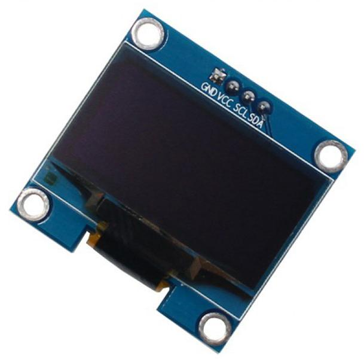                                  |
|**TP-Link TL-WN725N**                              |`Second WiFi Network Adapter To Connect Multiple Networks` |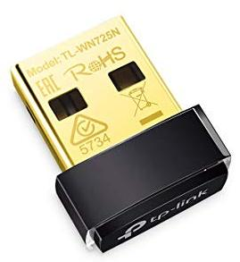                               |
|**Trust Vecco HU-4440P**                           |`USB HUB For Connecting Multiple USB Devices To Jetson`    |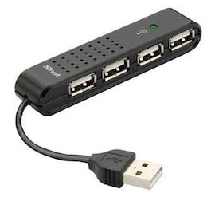                           |

#

> **Note:** Details and more will be added.

